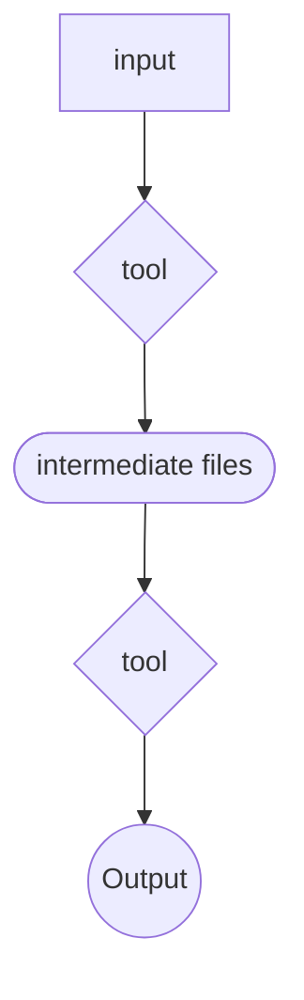

## ABOUT
*Explain what your pipeline does and the different ways it can be configured to run.*

## SUMMARY  
*Summary of the steps of your pipeline. A diagram can suffice.*  

*If a diagram is used, it should follow the following legend shapes:*

## USAGE
*Instructions on running the pipeline.*  
*Can include:*  
- *Command line/code snippets*
- *Images*
- *Video*
- *Diagrams*
- *Links*
- *Other*

## PARAMETERS

|Parameter | Value
|----|-----|
|*parameter name*| *explain what the parameter is and what type of value is expected* |

## OUTPUT
*Expected output files.*

## CREDITS
This pipeline was written by __. 

We thank the following people and teams for their assistance in the development of this pipeline:  
- __

## CONTRIBUTIONS
*Indicate whether the project is open for contributions.
If it is, indicate how to contribute.*

## CITATION
If you use this pipeline for your analysis, please cite it using the following doi: _

An extensive list of references for the tools used by this pipeline can be found in the [CITATIONS.md](CITATIONS.md) file.
